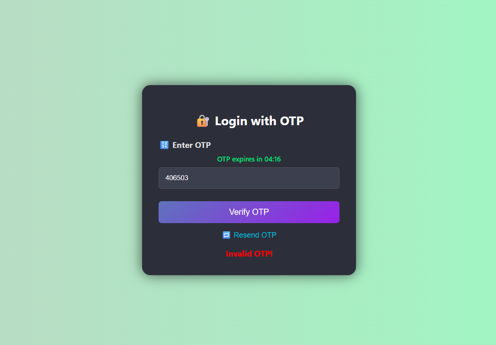

📧 OTP Verification App

A secure and modern OTP (One-Time Password) email verification system built using Node.js, Express, MongoDB, and Nodemailer. Users can enter their email, receive a 6-digit OTP, and verify it within 5 minutes. The UI includes animations, timer, and resend functionality.

🚀 Features :

🔐 OTP generation with expiration time

📩 Email delivery using Gmail SMTP via Nodemailer

⏱ OTP timer (5-minute countdown)

🔁 Resend OTP option with overwrite

✅ Tick animation on successful verification

🎨 Modern colorful UI with dark theme and dynamic background

🔒 Secrets stored securely using .env

📸 Preview

Technologies Used

Node.js

Express.js

MongoDB (local)

Mongoose

Nodemailer

HTML5, CSS3, JavaScript

dotenv

🧾 License

This project is open-source and free to use.
